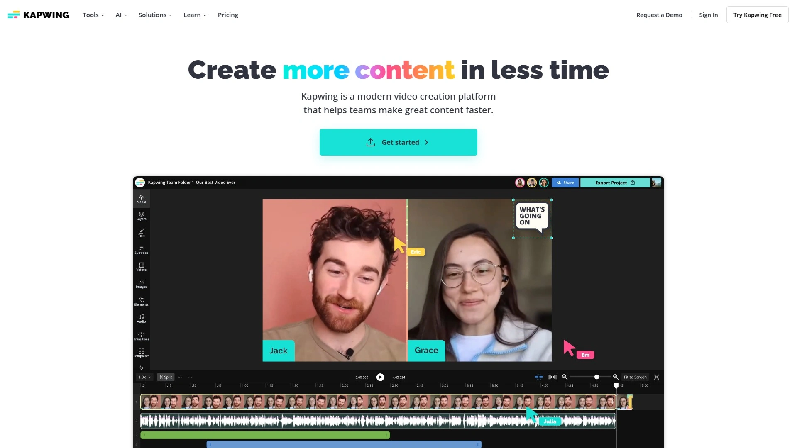

# 2025's Top 12 Best Auto Subtitle Generator Platforms

Ever uploaded a perfectly edited video to Instagram only to watch engagement tank because 85% of people scroll social media with sound off? You're spending hours manually typing captions, syncing timing to match speech, and reformatting text over and over while competitors pump out captioned content daily. The brutal reality hits when analytics show viewers dropping off within three seconds—not because your content sucks, but because they literally can't understand it without sound in their noisy commute or quiet office environment.

Auto subtitle generators solve this accessibility crisis by automatically transcribing speech, syncing captions perfectly to video timing, and adding eye-catching text animations that stop the scroll. You'll discover solutions ranging from simple caption-only tools to comprehensive video editors with AI transcription, offering accuracy levels from 85% to 99% across 80-120 languages with pricing from completely free to professional subscriptions under $30 monthly.

## **[Zubtitle](https://zubtitle.com)**

Social media video specialist optimizing content through automatic subtitles, headlines, and quick editing.

Zubtitle tackles the specific challenge of social media video optimization—grabbing attention when 80% of viewers watch with sound off. The platform automatically transcribes speech and converts it to video captions without manual typing or timing adjustments. Beyond subtitles, Zubtitle adds headlines that tease content, helping videos stand out in crowded feeds where first impressions determine whether people keep scrolling or actually watch.

The all-inclusive video repurposing capabilities let you resize and crop videos to match platform requirements—vertical for Stories and Reels, square for feed posts, horizontal for YouTube. Quick trimming tools highlight the most attention-grabbing portions rather than forcing viewers through entire clips to reach good parts. These editing features live in the same interface as captioning, eliminating the workflow friction of jumping between multiple tools.

Brand customization options including custom logos, watermarks, brand fonts, and colors create instantly recognizable content building loyal audiences. Save your styling as templates for even faster future editing—upload video, apply template, export in minutes rather than recreating formatting every time. The drag-and-drop editor makes professional results accessible without learning complicated video editing software that intimidates non-technical creators.

Zubtitle costs less than half the price of hiring virtual assistants to add captions manually, with transparent pricing eliminating subscription surprises. The platform accepts .mp4, .mov, and .m4v formats up to 1GB and 20 minutes, accommodating most social media content types. Free trial provides two video credits accessing all features including captioning—test the full workflow risk-free before committing. For creators, marketers, and businesses needing social-optimized videos fast without professional editing skills, Zubtitle delivers the specific tools that matter most.

## **[Kapwing](https://www.kapwing.com)**

99% accurate AI subtitles with comprehensive video editing suite for individuals and teams.

Kapwing delivers industry-leading subtitle accuracy at 99% while streamlining creation for both individual creators and entire content teams. The automatic subtitle generator produces word-by-word captions with fully editable transcripts in seconds, supporting export formats like SRT for use on other platforms. This accuracy minimizes the editing burden that plagues less sophisticated tools producing sloppy transcriptions requiring extensive correction.

The platform extends far beyond basic captioning into comprehensive video editing—trim, crop, resize, add music, apply effects, and collaborate with team members all in the same workspace. This breadth eliminates tool sprawl where you need one app for captions, another for editing, and a third for collaboration. Teams managing content libraries benefit especially from unified workflows where multiple people contribute to projects without version control nightmares.

Customization options for font, size, color, and placement ensure subtitles match brand guidelines or aesthetic preferences rather than generic default styling. The emphasis on making videos engaging, memorable, and easy to understand extends subtitle utility beyond mere accessibility into active engagement tools. For product demos, tutorials, and instructional content, reading along while watching helps viewers absorb technical terms and step-by-step processes more effectively.

Kapwing specifically targets creators producing in-depth content where comprehension matters as much as entertainment. The platform transforms passive watching into active learning through subtitle-enhanced clarity. Free tiers provide substantial functionality for testing and light use, with paid plans unlocking additional features for serious creators. The combination of top-tier accuracy, editing breadth, and team collaboration positions Kapwing as complete content production environment rather than single-purpose caption tool.

## **[VEED.IO](https://www.veed.io)**

Mobile-optimized editor with 99.9% accuracy auto-subtitles and professional editing tools for social growth.

VEED.IO recognizes that mobile consumption dominates social media, specifically designing features for viewers watching videos on phones in shared offices, subways, or loud environments where sound isn't option. The 99.9% accuracy claim represents aggressive positioning at the top end of automatic transcription capabilities. The auto-subtitle AI software generates captions in one click after uploading videos—select language, click generate, and captions appear.

The subtitle editor provides complete style control including font, size, color, and positioning with options to "burn" captions permanently into video or download separate subtitle files. This flexibility accommodates different use cases—permanent captions for social media posts versus separate files for YouTube or streaming platforms. Translation capabilities automatically convert existing subtitles into other languages, expanding content reach internationally without manual transcription in each target language.

VEED.IO positions itself as comprehensive video editing platform rather than caption-only tool, offering all the professional features needed for social media growth. The drag-and-drop interface makes sophisticated editing accessible to non-professionals wanting polished results. Real-time preview shows exactly how captions will look before exporting, preventing surprises when content goes live.

The emphasis on boosting reach and engagement through properly captioned videos reflects understanding that accessibility features double as growth tactics. Free tiers let users test capabilities, with premium subscriptions unlocking advanced features like automatic translation. For creators serious about social media growth who need both captioning and editing in one platform, VEED.IO delivers professional results through approachable interfaces.

## **[Riverside](https://riverside.fm)**

Best overall platform combining 99% accurate AI transcription with complete recording and editing workflow.

Riverside stands out by integrating transcription with high-quality recording and full editing capabilities rather than forcing separate tools for each workflow stage. The 99% accuracy AI transcription supporting 100+ languages makes it genuinely versatile for international content creators. Speaker detection automatically identifies who's talking in multi-person recordings, keeping captions clean and clear without manual speaker labeling.

Real-time progressive uploads protect against data loss during lengthy recording sessions—content saves continuously to cloud rather than risking everything on single upload after finishing. This reliability matters critically for long-form interviews, podcasts, or webinars where connection issues could otherwise destroy hours of work. The all-in-one nature means recording studio-quality audio and 4K video, editing content, adding captions, and sharing to platforms all happen in unified environment.

Customization options for font, size, color, and positioning ensure captions match branding rather than looking generic. Support for both open and closed caption formats provides flexibility for different distribution channels. The platform particularly shines for podcasters, interviewers, and educators creating long-form content requiring professional recording quality alongside accurate transcription.

Riverside's free tier includes genuinely useful features rather than crippled versions forcing immediate upgrades. Paid plans starting at $15 monthly unlock additional capabilities for serious creators. The combination of recording, editing, and captioning in single platform justifies pricing through consolidated workflow efficiency. For content creators wanting end-to-end production environment rather than piecing together separate tools, Riverside delivers cohesive experience from record through final export.

## **[Captions.ai](https://captions.ai)**

Social-first captioning app with AI director, editing, and advanced caption styling for viral content.

Captions.ai specifically targets social media creators wanting videos that stop the scroll through eye-catching animated captions and professional editing. The platform emphasizes visual appeal alongside functionality—captions don't just convey words, they actively grab attention through motion and styling. This design philosophy aligns perfectly with TikTok, Instagram Reels, and YouTube Shorts where visual hooks determine whether viewers watch or scroll.

The AI-powered features extend beyond transcription into content optimization including automated editing suggestions and clip identification. Advanced caption styling options create the dynamic word-by-word animations and colorful text treatments characteristic of viral short-form content. These stylistic capabilities matter enormously in crowded social feeds where professional-looking captions signal quality content worth watching.

The app works seamlessly across iOS and Android, recognizing that many social creators shoot, edit, and publish entirely from mobile devices. This mobile-first design contrasts with desktop-centric tools requiring computer access. For creators building social presence through consistent daily posting, mobile accessibility removes friction between content ideas and published videos.

Captions.ai competes directly with tools like CapCut and SubMagic in the social-optimized video space rather than traditional video editing platforms. The focus on virality and engagement over technical editing depth suits influencers, brands, and marketers prioritizing social growth. Pricing and feature tiers accommodate both casual creators and serious content teams managing multiple accounts and campaigns.

## **[OpusClip](https://opus.pro)**

AI video clipping specialist turning long-form content into viral shorts with automatic captions.

OpusClip differentiates through AI-powered clip identification that automatically finds the most compelling moments in long videos and extracts them as standalone shorts. This capability transforms hour-long podcasts, webinars, or streams into dozens of shareable social clips without watching entire recordings manually searching for good segments. The time savings compound dramatically for creators producing regular long-form content.

The AI analyzes content for viral potential, helping creators prioritize which clips to polish and publish rather than editing everything then hoping something performs. This data-driven approach to content repurposing increases efficiency by focusing effort on clips most likely to drive engagement. Automatic captioning integrates seamlessly into the clipping workflow—extracted clips arrive with captions already applied rather than requiring separate captioning steps.

OpusClip works effectively across genres rather than limiting to specific content types, making it versatile for educational content, entertainment, business presentations, and more. The platform can edit with or without user input—fully automated for hands-off workflow or collaborative for creators wanting control over final results. This flexibility accommodates different working styles and quality standards.

The platform competes directly with tools like SubMagic and Captions.ai in the social content space but emphasizes clip extraction over pure captioning or editing. For creators with libraries of long-form content needing efficient repurposing into social clips, OpusClip's AI identification capabilities save hours of manual review. Pricing structures typically follow per-minute or subscription models based on processing volume.

## **[SubMagic](https://submagic.co)**

Dynamic caption specialist with viral styling, emoji integration, and content optimization for shorts.

SubMagic gained popularity as early pioneer in autogenerated captions with dynamic styling that became synonymous with viral short-form content. The platform focuses intensely on caption aesthetics—bold fonts, bright colors, word-by-word animations, and automatic emoji insertion that enhance emotional impact. These visual treatments transform captions from accessibility features into engagement drivers that make content more watchable.

The tool offers both caption generation for existing videos and long-to-short transformation for repurposing content. Template libraries provide starting points for different content types and platforms, accelerating production for creators publishing regularly. The emphasis on viral aesthetics particularly suits creators chasing trending formats and maximizing shareability over timeless evergreen content.

SubMagic competes in crowded space alongside Captions.ai, OpusClip, and others, differentiating through specific styling capabilities and template quality. The platform excels at creating animated, stylized, emoji-enhanced captions optimized for social platforms. However, it offers fewer comprehensive editing tools than competitors like VEED.IO or Kapwing, positioning as specialized caption and style tool rather than full editor.

For creators prioritizing attention-grabbing captions over deep editing capabilities, SubMagic delivers the specific aesthetic that performs well on TikTok, Instagram, and YouTube Shorts. The tool works efficiently when paired with other platforms handling primary editing—use CapCut or Premiere Pro for video editing, then SubMagic for final subtitle polish adding viral styling. Pricing typically follows subscription models with tiers based on video output volume and feature access.

## **[Descript](https://www.descript.com)**

Revolutionary text-based video editing with Overdub AI voice insertion and podcast-focused workflow.

Descript transforms video editing by letting you edit transcribed text instead of timeline manipulation—delete words from transcript and corresponding video automatically trims. This paradigm shift makes editing intuitive for writers and non-technical creators uncomfortable with traditional video editing interfaces. The transcription accuracy reaches approximately 95%, providing reliable foundation for text-based editing workflow.

The mind-blowing Overdub feature lets you insert words into recordings using AI-generated voice matching your own or stock voices. Forgot mentioning a guest's credentials in the introduction? Type the missing words and Overdub adds them to your audio track with startling accuracy. This capability eliminates re-recording entire sections for minor additions or corrections—game-changing for perfectionists and time-constrained creators.

Descript specifically targets podcasters and video creators with features streamlining audio and video content production beyond pure transcription. Studio Sound instantly improves audio quality using AI that removes background noise and enhances vocal clarity. Multi-track editing, screen recording, and collaboration tools create comprehensive production environment for teams creating regular content.

The White Glove human transcription service achieves 99% accuracy for $2 per minute with two-hour maximum length—expensive but valuable when accuracy is critical. For typical usage, the AI transcription suffices with manual cleanup for rough spots. Pricing starts around $20 monthly for individual creators, with higher tiers for teams and heavy users. Descript suits podcasters, YouTubers, and content teams prioritizing editing speed over learning complex traditional video editors.

## **[Rev](https://www.rev.com)**

Human transcription gold standard achieving 99% accuracy with professional transcriptionists in 24 hours.

Rev differentiates by offering human transcription alongside AI options, achieving 99% accuracy through professional transcriptionists rather than purely algorithmic approaches. The 24-hour turnaround for human transcription balances accuracy needs against time constraints—slower than instant AI but dramatically more accurate. This precision matters critically for legal content, medical recordings, academic research, or any scenario where errors carry consequences.

The service supports clean verbatim transcription removing filler words like "um" and "you know" or full verbatim capturing every utterance for linguistic analysis or legal documentation. Additional options include timestamps, support for three or more speakers, and handling of low-quality audio challenging for automated systems. These premium features acknowledge that real-world recordings often contain complexity defeating automated tools.

Rev's platform emphasizes simplicity—upload audio in nearly any format including .mp3, .m4a, .webm, video files, or paste links to Dropbox, Google Drive, YouTube, or Vimeo content. Ordering takes around five clicks, and completed transcripts download with single click from notification email. This streamlined experience suits professionals valuing time and accuracy over budget optimization.

Pricing follows per-minute charges rather than subscriptions, with human transcription costing more than AI but delivering superior results. For content where accuracy justifies cost—interviews for publication, legal proceedings, medical documentation—Rev's human transcription provides quality assurance automated tools can't match. Budget-conscious creators use AI transcription for most content, reserving human transcription for critical projects demanding perfection.

## **[HappyScribe](https://www.happyscribe.com)**

Professional subtitle editor with interactive timeline, format management, and human transcription options.

HappyScribe provides free online subtitle editor with professional features including interactive SRT editing, CPS and CPL management, visual subtitle timeline, and timecode control. The ability to export in SRT, VTT, and STL formats ensures compatibility across different platforms and use cases. Real-time preview shows exactly how subtitles will appear, preventing formatting surprises when content goes live.

The platform offers tiered services balancing speed, accuracy, and cost—automatic subtitles at 85% accuracy with five-minute turnaround, human-made subtitles at 99% accuracy within 24 hours, and human-made translated subtitles at 99% accuracy in 48 hours. This service menu lets users choose appropriate solution for specific projects rather than one-size-fits-all approaches.

The emphasis on social media context acknowledges that 70% of video files on social platforms stream without sound, making captions increasingly essential rather than optional accessibility features. HappyScribe specifically designs workflows for social content creators needing fast turnaround on caption creation. The tool accepts files from most platforms, simplifying integration into existing production workflows.

The 4.8 out of 5 rating based on 850+ reviews demonstrates sustained user satisfaction across large customer base. Professional features like CPS (characters per second) and CPL (characters per line) management appeal to subtitle professionals maintaining broadcast standards. For creators wanting professional-grade subtitle editing capabilities without expensive desktop software, HappyScribe delivers comprehensive free tool supplemented by paid transcription services for projects demanding higher accuracy.

## **[Vizard.ai](https://vizard.ai)**

AI-powered content repurposing turning long videos into social clips with customizable captions.

Vizard.ai emphasizes global reach by supporting 30+ languages for subtitle generation, making content accessible across linguistic boundaries. The AI produces precise, contextually accurate subtitles rather than literal word-by-word translations missing cultural nuance. This multilingual capability serves creators building international audiences or businesses operating across regions.

Customization options including various fonts, styles, and sizes let creators match branding or convey specific messaging aesthetics. The subtitle styling creates visually appealing content beyond mere functional text—important for platforms where visual presentation significantly impacts engagement. Accessibility features ensure content reaches viewers who are deaf, hard of hearing, or those preferring silent viewing in noisy or quiet environments.

The platform automates what traditionally required hours of manual captioning, transforming tedious process into few minutes of automated efficiency. This time savings compounds for regular content creators publishing daily or weekly—hours saved per video multiply into days saved monthly. The cost-effectiveness eliminates paying expensive transcription services while delivering comparable accuracy quickly.

Vizard.ai targets content creators and marketers needing both video repurposing (turning long content into social clips) and caption generation rather than caption-only tools. The platform analyzes long videos to identify shareable moments, automatically creates clips, and adds captions in unified workflow. For brands and creators with substantial video libraries needing efficient social media repurposing, Vizard.ai's automated approach maximizes content ROI through intelligent clip identification and caption generation.

## **[CapCut](https://www.capcut.com)**

Free mobile and desktop editor with integrated auto-captions, massive template library, and social optimization.

CapCut achieves remarkable adoption through completely free access to professional editing features including auto-caption generation across 100+ languages. The mobile app dominates among social creators for its combination of powerful editing tools and effortless sharing directly to TikTok and Instagram. Desktop versions provide more extensive editing capabilities while maintaining free access unusual among professional-grade tools.

The auto-caption feature generates subtitles with one click then provides massive collections of well-designed caption styles ready for immediate application. Caption customization includes fonts, colors, animations, and positioning with templates accelerating production dramatically. The AI caption generator detects video language automatically or lets you manually select for precision.

Caption boost functionality adds emojis, stickers, text effects, and sound effects enhancing visual impact beyond basic subtitles. Keyword highlighting emphasizes important phrases drawing viewer attention. Translation features convert captions into different languages expanding content reach internationally. These enhancement capabilities position CapCut beyond basic transcription into full caption styling platform.

The platform's zero-cost model funded by TikTok parent company ByteDance enables features typically requiring paid subscriptions elsewhere. Free access democratizes professional video creation for students, emerging creators, and budget-conscious businesses. The seamless export to TikTok reflects strategic positioning within ByteDance's content ecosystem. For mobile-first creators wanting powerful free editing with integrated captions, CapCut delivers unbeatable value despite occasional ads and watermarks on free exports.

## **[Adobe Premiere Pro](https://www.adobe.com/premiere)**

Industry-standard professional editing software with built-in automatic captioning and comprehensive post-production.

Adobe Premiere Pro includes automatic captioning as one feature within comprehensive professional video editing suite used by Hollywood studios, YouTubers, and everyone between. The auto-caption tool converts audio to text creating editable caption tracks you can customize extensively. Transcription supports multiple languages through downloadable language packs enabling multilingual content production.

The professional context means Premiere's captioning integrates with color grading, effects, audio mixing, and all other post-production workflows in unified timeline-based interface. This integration matters for professional productions requiring precise control over every aspect rather than simple social media clips. Advanced users leverage Premiere's power for complex projects while still accessing convenient auto-captioning.

Third-party plugins like AutoCut and Submachine enhance Premiere's native captioning with dynamic subtitle styles popular on social media. These extensions bring TikTok-style animated captions into professional editing environment, bridging gap between casual social tools and professional software. The plugin ecosystem expands Premiere's capabilities beyond Adobe's built-in features.

Premiere Pro requires Creative Cloud subscription ($54.99 monthly for individual app or included in $99.99 All Apps bundle), positioning as premium professional tool rather than casual creator solution. The learning curve intimidates beginners—full mastery requires weeks or months of practice. However, for professional video editors, marketing agencies, and content teams needing industrial-strength editing alongside captioning, Premiere Pro remains industry standard delivering unmatched power and precision. The captioning features work well but represent small fraction of Premiere's comprehensive post-production capabilities.

## FAQ

**Do automatic subtitle generators actually save time compared to manual captioning?**

Absolutely—automatic subtitle generators like Zubtitle, Kapwing, and VEED.IO transcribe videos in minutes rather than hours required for manual typing and timing. A 10-minute video taking 40-60 minutes to caption manually gets transcribed in 2-3 minutes automatically with 85-99% accuracy requiring only minor corrections. The time savings compound dramatically for regular content creators publishing daily or weekly, potentially saving 10-20 hours monthly. However, accuracy varies by audio quality, speaker accents, and technical jargon—clean studio recordings with clear speech produce better results than noisy field recordings or heavy-accented speakers. Most creators find automatic generation plus quick editing faster than manual captioning even accounting for correction time.

**Can I use automatically generated subtitles for professional content or legal compliance?**

Automatic subtitle generators achieve 85-99% accuracy suitable for social media and most commercial content but may not meet strict legal compliance standards requiring human verification. For ADA compliance, legal proceedings, medical documentation, or broadcast television, services like Rev and HappyScribe offer human transcription achieving 99%+ accuracy with 24-48 hour turnaround. Many creators use automatic captions for social media while investing in human transcription for critical projects like course content, legal videos, or accessibility compliance documentation. The cost difference is substantial—AI captions cost pennies per minute while human transcription runs $1-2 per minute, so choose based on accuracy requirements and consequences of errors.

**How do I choose between free and paid subtitle generation tools?**

Free tools like CapCut, Kapwing's free tier, and VEED.IO's basic plan provide excellent capabilities for casual creators and small budgets, typically including basic transcription and simple styling with watermarks or limited exports. Paid tools ($10-30 monthly) eliminate watermarks, increase accuracy, add advanced styling options, provide priority processing, and offer team collaboration features valuable for consistent content production. Consider upgrading when watermarks compromise branding, you need faster turnaround, accuracy impacts content quality, or you're producing enough volume to justify subscription costs through time savings. Many creators start free to test workflows then upgrade as content production scales and quality standards increase.

## Conclusion

The automatic subtitle generation landscape offers solutions for every creator type from casual social posters to professional video producers, with tools ranging from simple transcription-only services to comprehensive editing suites with integrated captioning. Your choice depends on whether you prioritize mobile convenience, styling flexibility, editing depth, or professional accuracy alongside fundamental transcription capabilities. [Zubtitle](https://zubtitle.com) excels for social media creators needing fast video optimization without technical complexity—the automatic transcription, social-specific editing tools including resizing and trimming, headline text overlays, and brand customization options deliver exactly what matters for stopping the scroll on muted feeds. The platform's focus on social optimization rather than general video editing makes it ideal for marketers, influencers, and businesses prioritizing engagement and accessibility on Instagram, TikTok, Facebook, and LinkedIn where captions transform from nice-to-have into essential competitive advantage.
